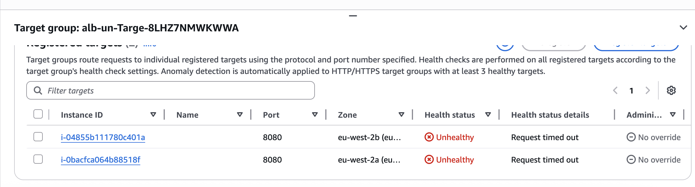
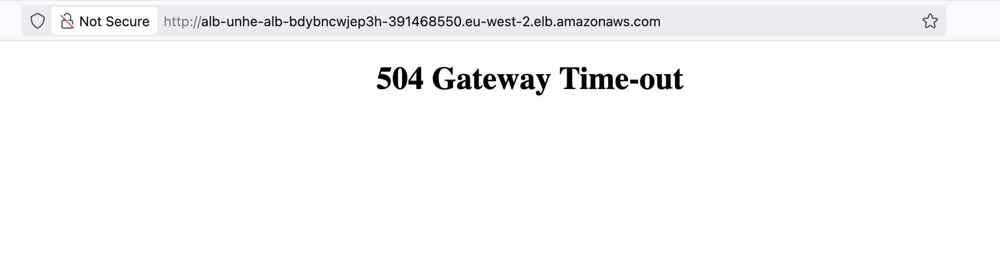
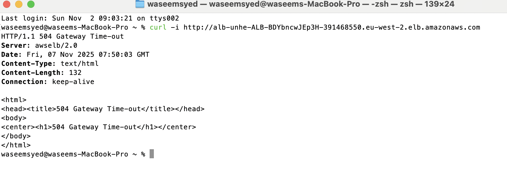

# ALB 5xx & Unhealthy Target Break-Fix

A hands-on troubleshooting and debugging project built on **AWS CloudFormation**, focusing on diagnosing and resolving **Application Load Balancer (ALB)** 504 errors and unhealthy EC2 targets within an **Auto Scaling Group (ASG)**.


---

## Overview

In this project, i investigated **why the ALB targets are unhealthy** and **why 504 errors** occur, then fix them step-by-step using logs, metrics, and System Manager (SSM).

---

## Architecture

- **VPC** with two Availability Zones (AZs)  
- **Public subnets** hosting the Application Load Balancer (ALB)  
- **Private subnets** hosting an Auto Scaling Group (ASG) of EC2 web servers  
- **SSM Session Manager** enabled (no SSH needed)  
- **VPC Flow Logs** to CloudWatch for packet inspection  


---

## Objectives

- Diagnose ALB 504 and unhealthy targets  
- Use **Target Health**, **VPC Flow Logs**, **CloudWatch**, and **SSM**  
- Verify connectivity, ports, and security group dependencies  
- Fix and validate service recovery  

---

## Troubleshooting Process

| Step | Action | AWS Tool |
|------|--------|----------|
| 1 | Inspect ALB Target Group health status | EC2 → Target Groups |
| 2 | Check instance reachability and port | SSM Session Manager |
| 3 | Review flow logs for rejects | CloudWatch Logs |
| 4 | Examine user-data execution logs | `/var/log/cloud-init.log` |
| 5 | Fix SG and health check configuration | Console / CLI |



---

## Fix Summary

| Fault | Root Cause | Fix |
|--------|-------------|-----|
| Fault A | Instance SG missing inbound from ALB | Add inbound rule: Source=ALB-SG, Port=8080 |
| Fault B | Health check path incorrect | Change `/wrong` → `/health` |

---


Retrieve ALB DNS:
```bash
aws cloudformation describe-stacks   --stack-name alb-unhealthy-targets   --query "Stacks[0].Outputs[?OutputKey=='AlbDNSName'].OutputValue"   --output text
```

Visit the DNS in your browser to reproduce the 502/504 error.



- Curl test:
Direct curl health check.
```bash
curl -i http://alb-unhe-ALB-BDYbncwJEp3H-391468550.eu-west-2.elb.amazonaws.com


---

## Validation

After applying fixes:

- ALB Target Group status: **Healthy**
- Browser: Application reachable
- Curl test:
  ```bash
  curl -i http://alb-unhe-ALB-BDYbncwJEp3H-391468550.eu-west-2.elb.amazonaws.com 
  ```
  Returns `200 OK`.


---

##  Skills Practiced

- CloudFormation (IaC)
- Networking & Security Groups
- ALB Target Health Analysis
- CloudWatch & Flow Logs
- EC2 + Auto Scaling Debugging
- SSM Session Manager
